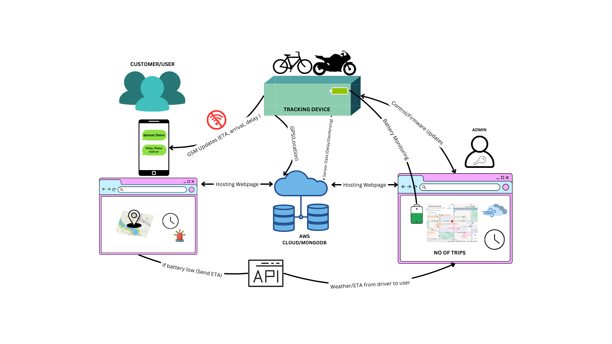
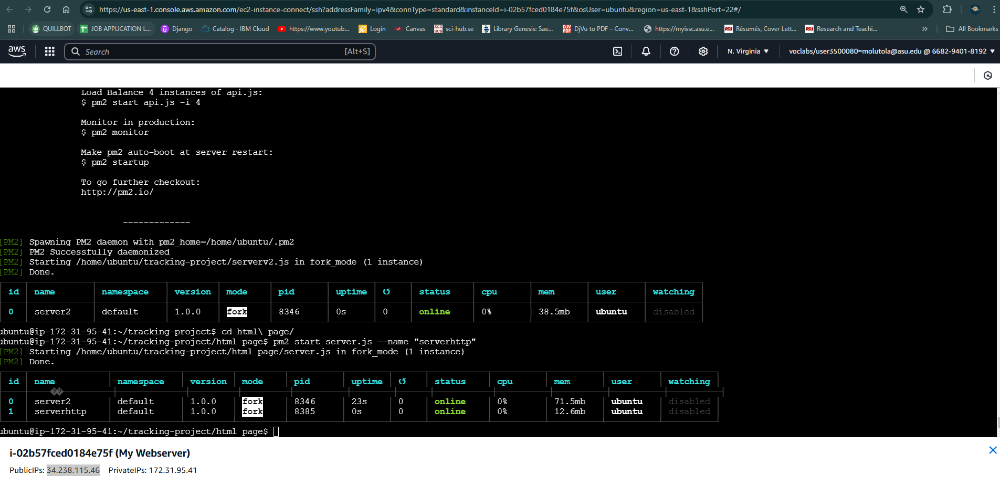
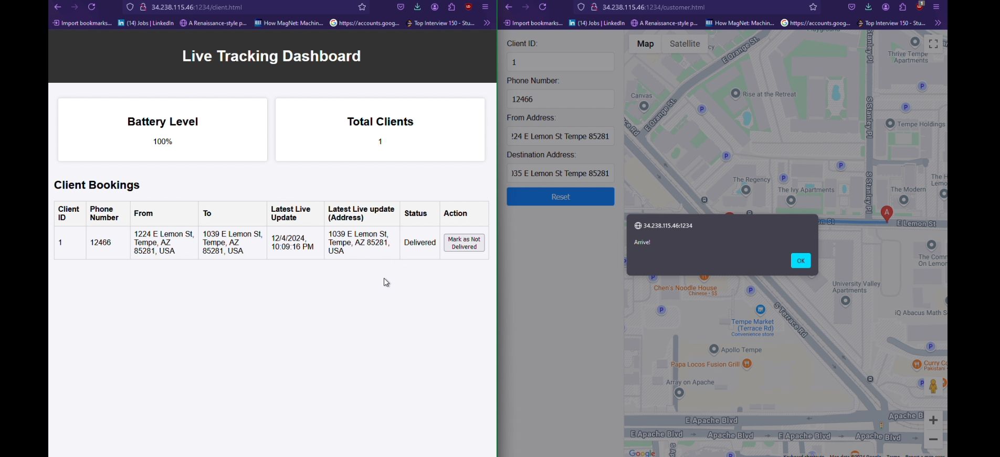
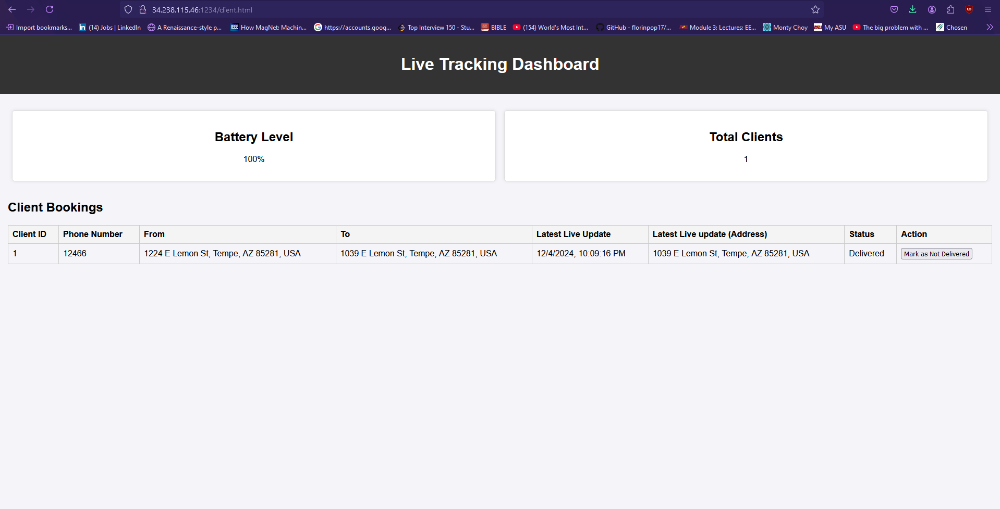
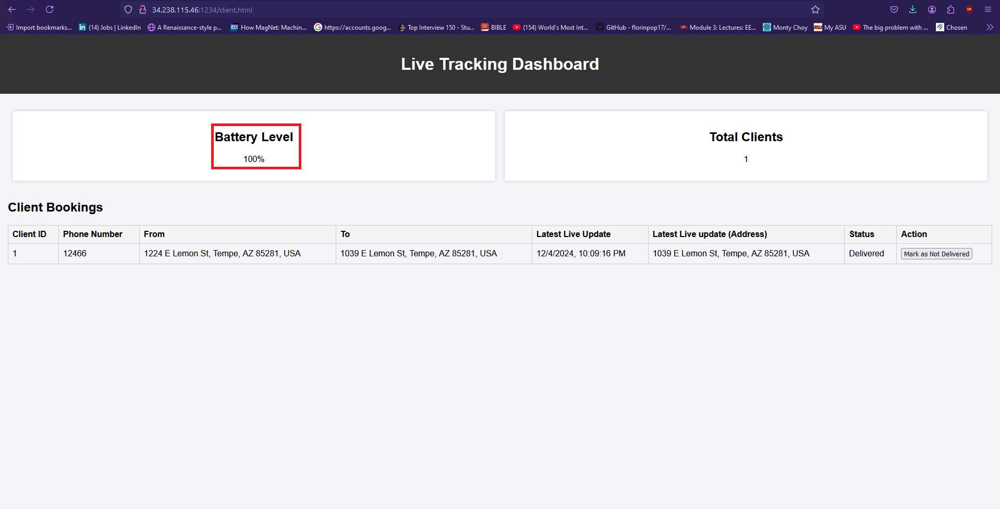
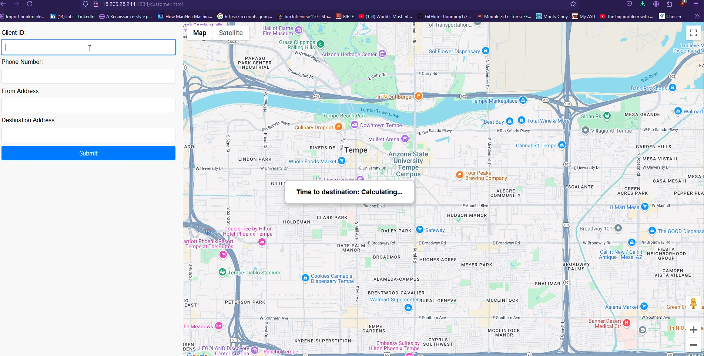
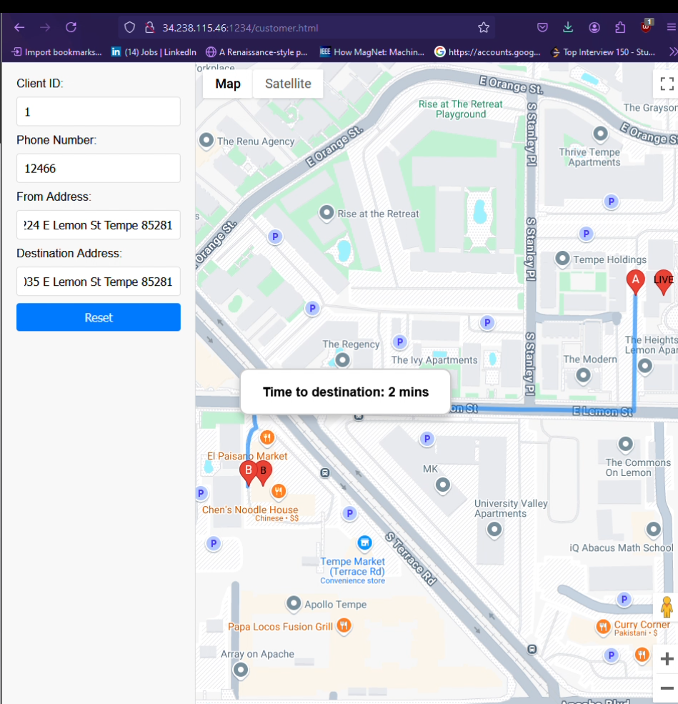
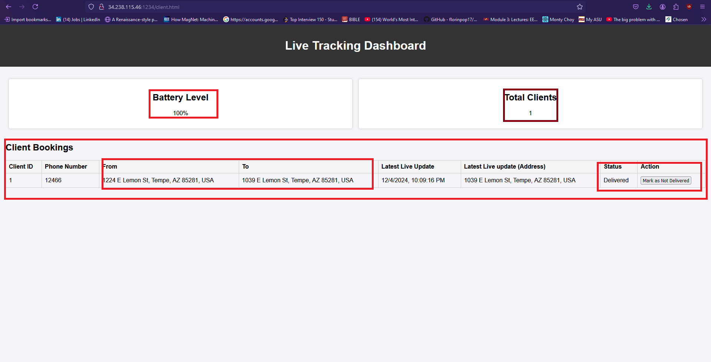

# Final Report: IoT Based Tracking System

## Summary

This repository contains the code and detailed instructions for setting up an IoT-based tracking system. The system features a tracking device built with the LilyGO TSIM 7080, capable of sending real-time location updates to a server. These updates can be monitored through an intuitive web interface. Designed for reliability, the tracking device operates seamlessly in environments with limited or no Wi-Fi connectivity, leveraging a GSM module for redundancy.

### System Design



## Repository Overview

- **Sketch (`tracking.ino`)**: This code runs on the LilyGo TSIM 7080, handling GPS data, sending location updates, and managing power states.
- **Server Code (`SERVERV2.js`)**: This Node.js server handles incoming data from the tracking device, stores it in a MongoDB database, and serves it to the web interface.
- **Web Interface (`CUSTOMER.HTML`, `CLIENT.HTML`)**: These HTML files provide a user interface for tracking live locations and managing client data.
- **Styles (`STYLE.CSS`)**: CSS file for styling the web interface.

## Installation Instructions

1. **Upload the Sketch**:

   - Open `tracking.ino` in the Arduino IDE.
   - Connect the LilyGo T-SIM 7080 and upload the sketch.

2. **Set Up the EC2 Server**:

   - Launch an EC2 instance on AWS.
   - SSH into the instance and install Node.js and MongoDB.
   - Install `pm2` for process management:
     ```sh
     npm install pm2 -g
     ```

3. **Run the Servers**:

   - Navigate to the directory containing
     SERVERV2.js

   - Start the server using `pm2`:
     ```sh
     pm2 start SERVERV2.js --name "Server-1"
     ```
   - Also Navigate to the directory containing server.js in the http-client

   ```sh
      pm2 start server.js --name "http-server"
   ```

4. **Update IP Address**:

   - In the Arduino sketch (`tracking.ino`), update the server IP address to the IP address of your EC2 instance.

5. **Monitor Battery**:
   - Ensure the Lithium Ion battery connected to the LilyGo TSIM 7080 is charged. Integrate solar charging circuits or charge via USB-C if the battery is low.

## Usage Instructions

- **Starting the Tracking Device**:
  - Once the sketch is loaded, the tracking device (LilyGo TSIM 7080) will automatically turn on.
  - The device will send live location updates to the server.
  - When marked as delivered, the device enters sleep mode.
  - Upon waking, it checks the server for new client data. If a new client is available, it reinitializes; otherwise, it turns off.

## Statement of Need

In third-world countries, many dispatch riders lack access to smartphones. This tracking device is designed to work in environments with limited or no Wi-Fi access, automatically connecting and sending live updates using GSM for redundancy. The goal is to develop a portable, cost-effective, and battery-efficient tracking device for motorcycles and bicycles. The device sends text updates on trip progress (start, near destination, arrived) when the internet is unavailable. Real-time tracking is accessible via an app or web interface for managers.

## Demos

-**AWS EC2 Server**: Running the two servers on EC2 using pm2 

- **Live Tracking**: Monitor the live location of the tracking device via the web interface.

Pictures of a tracking interface on both the client and customer pages, showing the final status as 'Delivered' along with a live update of the last location.



- **Battery Monitoring**: The device sends live battery updates to the client page as long as it remains powered on.
  

- **Customer Interface**: An interface to enter the ID, phone number, origin address, and destinatio

n address.



- **Client Management**: Manage customer data and track delivery status through the web interface.
  
